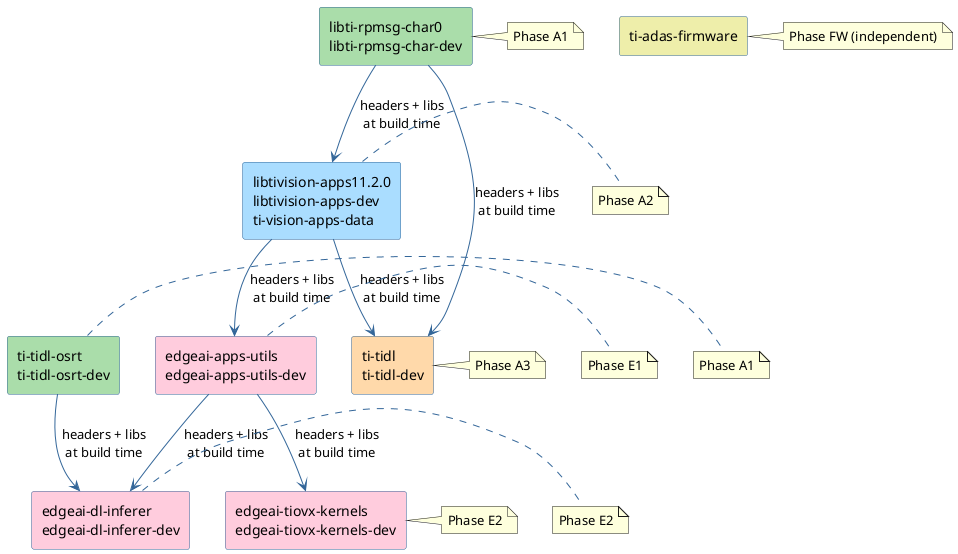
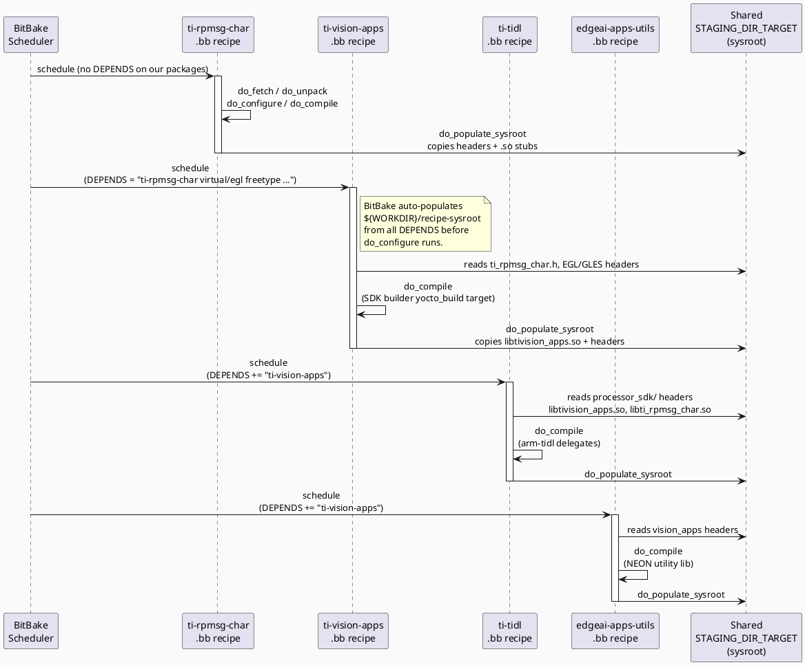
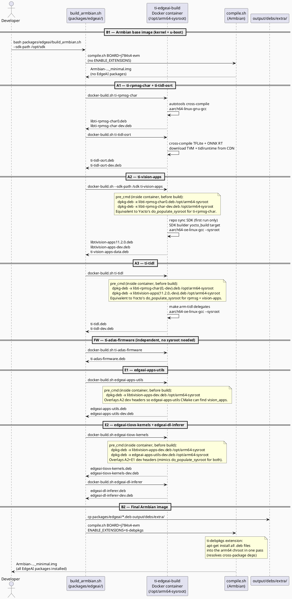
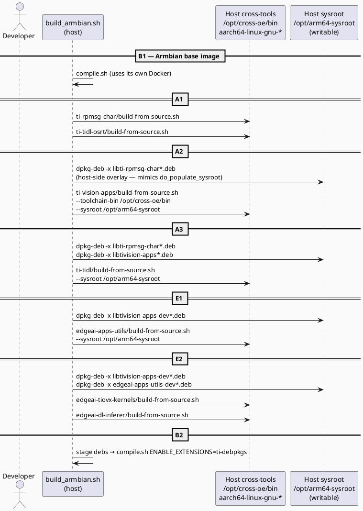
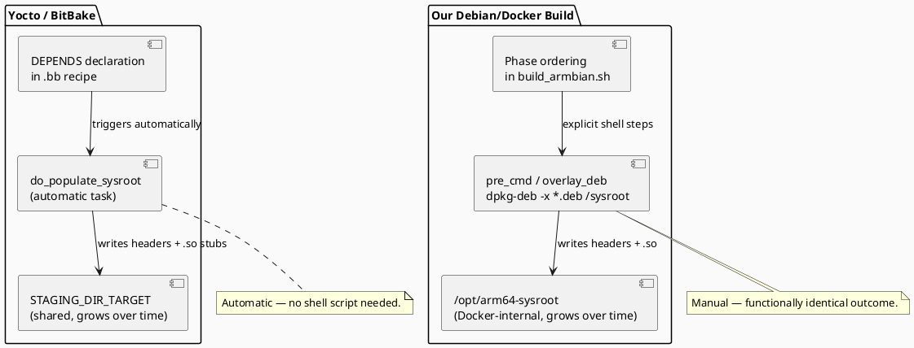

# TI EdgeAI + Armbian Build Architecture

## Overview

This document describes the complete build flow for TI EdgeAI packages on
Armbian/Ubuntu Noble for the j784s4-evm board family. It explains what
Yocto does natively, how our Debian-based build mimics the same sysroot
population model, and why there is no fundamentally simpler approach outside
of a dedicated build framework like Yocto.

---

## 1. Package Dependency Graph

The build-time dependency between packages drives the phase ordering.



`ti-tidl-osrt` and `ti-adas-firmware` have no build-time dependency on the
other packages. `ti-adas-firmware` is entirely independent (pre-built blobs).
Both A1 packages (`ti-rpmsg-char`, `ti-tidl-osrt`) can build in parallel.

---

## 2. How Yocto Manages This

Yocto (BitBake) resolves the dependency graph automatically through its
**recipe sysroot** mechanism.



**Key Yocto mechanisms:**
- Every recipe declares `DEPENDS` listing its build-time prerequisites.
- Before `do_configure` runs, BitBake automatically runs `do_populate_sysroot`
  for all `DEPENDS`, placing headers and `.so` stubs into
  `${WORKDIR}/recipe-sysroot`.
- There is one shared `STAGING_DIR_TARGET` that accumulates all target
  libraries and headers as recipes are built.
- **No manual sysroot management** is needed — the build framework handles it.

---

## 3. Our Debian Build Flow

We replicate the same dependency ordering outside of Yocto using Docker
containers and `.deb` overlay steps between phases.

### 3.1 Build sequence

```
B1  Armbian base image   — kernel, u-boot, firmware (no EdgeAI)
A1  ti-rpmsg-char        — autotools cross-compile
    ti-tidl-osrt         — TFLite + ONNX RT cross-compiled from source
A2  ti-vision-apps       — SDK builder source build (overlays A1 debs first)
A3  ti-tidl              — arm-tidl delegates (overlays A1+A2 debs first)
FW  ti-adas-firmware     — R5F MCU + C7x DSP RTOS firmware blobs (independent)
E1  edgeai-apps-utils    — NEON utility lib (overlays A2 dev headers first)
E2  edgeai-tiovx-kernels — OpenVX kernels (overlays A2+E1 dev headers first)
    edgeai-dl-inferer    — DL inference abstraction (overlays A1+E1 dev headers)
B2  Final Armbian image  — installs all EdgeAI .deb packages
```

B1 and A/FW/E phases have no dependency on each other, so B1 runs first (it
is the longest step) and A/E phases run afterward. B2 requires both B1 and
all A/E phases to be complete.

### 3.2 Docker mode (default, tested)



### 3.3 No-Docker mode (not tested end-to-end)

Each package's `build-from-source.sh` is called directly on the host.
The `.deb` overlay step runs on a host-side writable sysroot instead of
inside a container. See prerequisites in `packages/edgeai/build_armbian.sh`.



---

## 4. Yocto vs. Debian Build System Comparison



| Aspect | Yocto | Our Debian/Docker Build |
|---|---|---|
| Dependency declaration | `DEPENDS = "pkg"` in `.bb` recipe | Phase ordering in `build_armbian.sh` |
| Sysroot population | Automatic via `do_populate_sysroot` | Manual `dpkg-deb -x` overlay between phases |
| Sysroot location | `${STAGING_DIR_TARGET}` (shared) | `/opt/arm64-sysroot` in Docker container |
| Cross-compiler | OE toolchain (`aarch64-oe-linux-`) | Ubuntu `aarch64-linux-gnu-` + OE compat shim |
| Package format | `.ipk` / `.rpm` | `.deb` |
| Build isolation | Separate `WORKDIR` per recipe | Docker container per package group |
| Incremental build | BitBake task hash tracking | `--skip-*` flags in `build_armbian.sh` |
| Host requirements | Yocto host tools + large initial download | Docker only (or cross-tools for no-Docker) |

---

## 5. Does Debian Have a More Efficient Flow?

Short answer: **No.**

Debian's packaging system (`dpkg`/`apt`) is designed for installing packages
on a running target, not for managing cross-compilation build trees. Its
multi-arch support (`dpkg --add-architecture arm64`) allows co-installing
arm64 and amd64 packages on an x86_64 host, but this:

- Requires `sudo` and modifies the host system permanently.
- Does not isolate builds between packages — a bad install can break all
  subsequent builds.
- Has no equivalent of Yocto's per-recipe `recipe-sysroot` snapshot.

The Debian ecosystem's conventional answer is **sbuild**, **pbuilder**
(chroot-based), or **Docker** — which is exactly what we use. Our Docker
container with `/opt/arm64-sysroot` is the Debian-idiomatic equivalent of
Yocto's `STAGING_DIR_TARGET`. The `.deb` overlay pattern is the closest
Debian equivalent of `do_populate_sysroot`.

---

## 6. Build Script Relationship

```plantuml
@startuml scripts
skinparam backgroundColor #FAFAFA

rectangle "packages/edgeai/build_armbian.sh" as top #AADDFF {
    note as n1
      Top-level orchestrator (TI-specific, not upstream).
      Sequence: B1 → A1 → A2 → A3 → FW → E1 → E2 → B2.
      --docker (default) / --no-docker.
      Self-derives repo root from BASH_SOURCE[0].
    end note
}

rectangle "packages/edgeai/docker-build.sh" as dbs #CCDDFF {
    note as n2
      Manages ti-edgeai-build Docker image.
      Handles pre_cmd .deb overlays before each phase.
    end note
}

rectangle "ti-rpmsg-char/build-from-source.sh" as rpmsg_bs #DDEEDD
rectangle "ti-tidl-osrt/build-from-source.sh" as osrt_bs #DDEEDD
rectangle "ti-vision-apps/build-from-source.sh" as va_bs #DDEEDD
rectangle "ti-tidl/build-from-source.sh" as tidl_bs #DDEEDD
rectangle "ti-adas-firmware/build-from-source.sh" as fw_bs #DDEEDD
rectangle "edgeai-apps-utils/build-from-source.sh" as eu_bs #FFCCDD
rectangle "edgeai-tiovx-kernels/build-from-source.sh" as etk_bs #FFCCDD
rectangle "edgeai-dl-inferer/build-from-source.sh" as edli_bs #FFCCDD

rectangle "compile.sh (Armbian)" as compile #FFEEDD {
    note as n3
      B1: base image (no EdgeAI)
      B2: + ENABLE_EXTENSIONS=ti-debpkgs
    end note
}

rectangle "extensions/ti-debpkgs.sh" as ext #FFE8BB

top --> dbs       : Docker mode A1/A2/A3/FW/E1/E2
top --> rpmsg_bs  : no-Docker A1
top --> osrt_bs   : no-Docker A1
top --> va_bs     : no-Docker A2
top --> tidl_bs   : no-Docker A3
top --> fw_bs     : no-Docker FW
top --> eu_bs     : no-Docker E1
top --> etk_bs    : no-Docker E2
top --> edli_bs   : no-Docker E2
top --> compile   : B1 and B2

dbs --> rpmsg_bs  : inside container
dbs --> osrt_bs   : inside container
dbs --> va_bs     : inside container
dbs --> tidl_bs   : inside container
dbs --> fw_bs     : inside container
dbs --> eu_bs     : inside container
dbs --> etk_bs    : inside container
dbs --> edli_bs   : inside container

compile --> ext   : B2 only
@enduml
```



---

## 7. Quick Reference

```bash
# Full build (B1 → A1 → A2 → A3 → FW → E1 → E2 → B2):
bash packages/edgeai/build_armbian.sh \
    --mirror   /mnt/DATA/YOCTO/yocto-build/downloads/git2 \
    --sdk-path /opt/ti-vision-apps-sdk

# Kernel already built — EdgeAI packages + final image only:
bash packages/edgeai/build_armbian.sh --skip-kernel \
    --sdk-path /opt/ti-vision-apps-sdk

# All debs already built — regenerate final image only:
bash packages/edgeai/build_armbian.sh --skip-kernel --skip-edgeai

# EdgeAI packages only (no Armbian image builds):
bash packages/edgeai/build_armbian.sh --skip-kernel --skip-image \
    --sdk-path /opt/ti-vision-apps-sdk

# E1+E2 only (A1-A3 and FW already built):
bash packages/edgeai/build_armbian.sh \
    --skip-kernel --skip-base-pkgs --skip-vision-apps --skip-tidl --skip-fw \
    --skip-image
```
